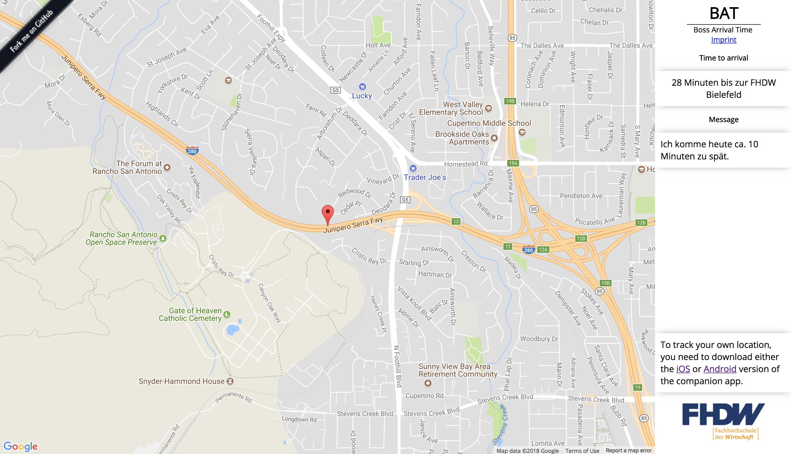

# FHDW - Boss Arrival Time
This is the official backend source code for the **Boss Arrival Time** project of the lecture PIT at the FHDW university.
This project represents our take on the [Weasley Clock](http://harrypotter.wikia.com/wiki/Weasley_Clock) from Harry Potter. The Weasly Clock shows the whole Weasly family and there current location. We took this functionality and tried to apply it to our professors/dean.

 

The idea was, that we have an app for Android and iOS which sends the current location to a backend server, which could then represent the location on a maps inside a browser. To accomplish that, we build a NodeJS backend which provides an API to create a new user and lets the client update his/her current location. This location would then be send to the browser using WebSockets to provide a real time representation of the current location.

# Get started
To run this server you need to have [NodeJS](https://nodejs.org/) installed and a [MongoDB](https://www.mongodb.com/) instance running. Also you may need to change some configurations inside the [`config.js`](https://github.com/bastilimbach/FHDW-BAT/blob/master/app/config.js) file.

Finally, run `npm start` to start the server on the configured port.
## Development
Start the server for development.
```bash
npm run-script start:dev
```
Lint your files using eslint.
```bash
npm test
```
## Deployment
The repository includes a [Dockerfile](https://docker.com) for easy deployment.
```bash
# Build the Docker image
docker build -t boss-arrival-time:latest .

# Run the Docker image
docker run -d -p 80:3000 --restart always --name bat-backend boss-arrival-time:latest
```
Using [Docker Compose](https://docs.docker.com/compose/) you can also run the server without the need to install MongoDB manually.
```bash
docker-compose up -d
```
> You may want to build/run the Docker image with the environment variables (MONGODB_URL, ADMIN_TOKEN, DOMAIN)
# Companion Apps
- iOS: [https://github.com/bastilimbach/fhdw-bat-app](https://github.com/bastilimbach/fhdw-bat-app)
- Android: `Repository doesn't exist yet`

# Contribution
You want to contribute? That's awesome! Go ahead an feel free to open a Pull Request with your bug fixes or new features. Please note that this project is released with a [Contributor Code of Conduct](https://github.com/bastilimbach/FHDW-BAT/blob/master/.github/CODE_OF_CONDUCT.md). By participating in this project you agree to abide by its terms.

# License
[MIT](https://github.com/bastilimbach/FHDW-BAT/blob/master/LICENSE) :heart:
